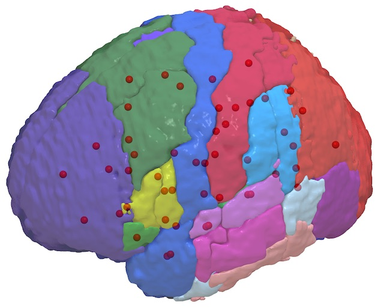

## Introduction

This is a Matlab script for converting voxelwise Atlases saved in NIfTI format to meshes saved in [MZ3](https://github.com/neurolabusc/surf-ice/tree/master/mz3) format used by [Surfice](https://www.nitrc.org/plugins/mwiki/index.php/surfice:MainPage#Atlas-based_Region_of_interest_Analyses). Also included is a script to create [nodes](https://www.nitrc.org/plugins/mwiki/index.php/surfice:MainPage#Loading_nodes).

## Requirements 

To run this script you will need:

 - Matlab
 - [SPM](https://www.fil.ion.ucl.ac.uk/spm/software/download/)
 - [spmScripts](https://github.com/rordenlab/spmScripts)
 - The scripts included in this repository
 - A NIfTI format atlas to convert

## Converting an Atlas from a voxelwise image to a mesh.

The command `nii_nii2atlas` will convert a NIfTI volume into a mesh. This repository includes a sample atlas, which you can convert with the command `nii_nii2atlas('HarvardOxford-cort-maxprob-thr0-1mm.nii.gz')`.
This command assumes that there is a reasonably small number of discrete regions in your atlas. In other words, you will not get sensible results if you provide a NIfTI image of a T1 anatomical scan where intensity is continuous. This script will create a MZ3 file. If you open this with Surfice, it will either appear shiny or matte. If it appears matte, it suggests that the front and back faces are reversed. Use the Advanced/ReverseFaces and Advanced/SaveMesh menu items to save a mesh where the front and back faces are specified correctly.

Optionally, you can provide a [Color Lookup Table](https://imagejdocu.tudor.lu/gui/image/lookup_tables) to map a specific region to a specific color. The Matlab script writeLut demonstrates how to create a custom color table. You can also use these color tables with [ImageJ](https://imagej.net/Welcome) and [MRIcron](https://www.nitrc.org/projects/mricron). A graphical LUT makers is [available](https://people.cas.sc.edu/rorden/mricro/lutmaker/index.html). You can use existing LUTs that are included with [ImageJ](https://imagej.nih.gov/ij/download/luts/) or use those included with MRIcron (stored in its `lut` folder).

## Converting an Atlas from a voxelwise image to a node map.

Node maps are useful for showing connectomes. The script `nii_nii2nodz` will open an atlas in NIfTI format and generate a sphere at the center of each region. This repository includes a sample atlas, which you can convert with the command `nii_nii2nodz('HarvardOxford-cort-maxprob-thr0-1mm.nii.gz')`.
 

